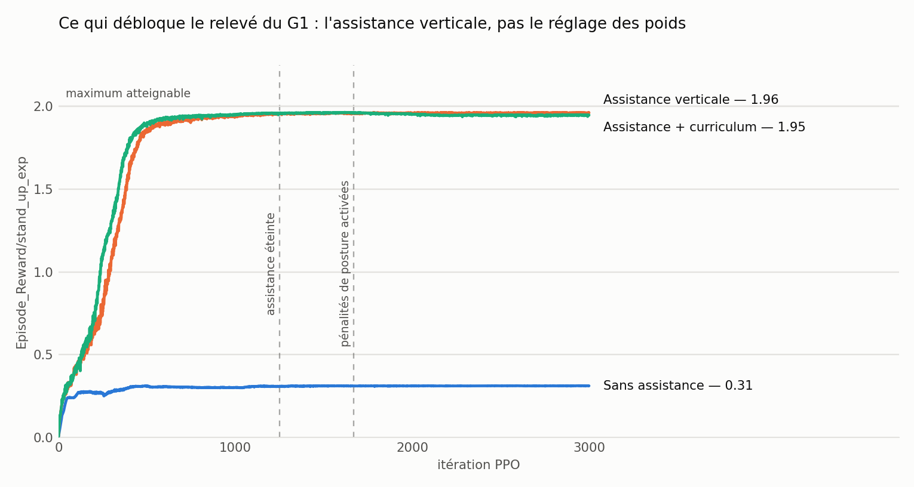

# G1 Fall Recovery

Teaching a Unitree G1 humanoid to stand back up from the ground, with reinforcement
learning in Isaac Lab.

The policy starts from a state a real fall produces — lying prone, supine or on its
side — and has ten simulated seconds to get its pelvis back to standing height and
hold it there.

<p align="center">
  
</p>

<p align="center"><em>Final policy, deterministic inference, no assist force.</em></p>

---

## Result

| Metric | Value |
|---|---|
| `stand_up_exp` (max 2.0) | **1.95** |
| Pelvis height error vs. the 0.74 m target | ~8 cm, time-averaged over the episode |
| Base tilt | `projected_gravity_b[:, 2]` ≈ −0.99 (vertical) |
| Horizontal drift | ~0.27 m/s RMS — it stands up in place |
| Training cost | 3000 PPO iterations, ~295M simulated steps, **~40 min on one RTX 4090** |

<picture>
  <source media="(prefers-color-scheme: dark)" srcset="media/00-curves-dark.png">
  
</picture>

The blue curve is the whole story: with a correct reward, a correct initial-state
distribution and 3000 iterations of PPO, the robot **never learns to stand up**. What
unlocks the task is the assist-force curriculum, not any amount of reward tuning.

---

## Setup

| | |
|---|---|
| Simulator | Isaac Lab 2.3.2 / Isaac Sim 5.1 |
| Robot | `G1_MINIMAL_CFG`, 44 bodies, 37 DOF |
| Parallel envs | 4096 |
| Episode | 10 s — 500 steps at 50 Hz control, 200 Hz physics |
| Observations | 106 — base linear/angular velocity, projected gravity, joint positions and velocities, last action |
| Actions | **23** joint position targets — the 14 finger joints are excluded |
| Algorithm | PPO (rsl_rl), actor & critic MLP `[512, 256, 128]`, ELU |
| Terrain | flat plane |

Only `time_out` ends an episode. There is deliberately no early termination: on a
get-up task, any contact-based termination fires on the very state the robot is
supposed to recover from.

### Reward

One term carries the objective:

```python
stand_up_exp = exp(-(h - 0.74)² / 0.5² - (g_z + 1)² / 1.0²)      # weight 2.0
```

`h` is the pelvis height; `g_z` is the vertical component of gravity expressed in the
base frame (−1 upright, 0 on the side, +1 upside down).

The two halves are **multiplied, not added**. That is not cosmetic — see stage 1.

Everything else is shaping or regularisation: `track_height` and `upright_exp` at
weight 0.25 so both halves stay legible in the logs, plus posture penalties introduced
by curriculum.

---

## How it got there

Four stages, each fixing what the previous one exposed.

### 1. Additive rewards → reward hacking


Height and uprightness were two separate reward terms, added. The policy converged to
`upright_exp` = 0.96 out of 1.0 while `track_height` stayed at 0.12 — it had found a
pose that collects the uprightness reward **without ever lifting its own weight**:
sitting on the floor, legs splayed, torso vertical.

That is 44% of the available task reward for no effort, and the saturated term offered
no gradient to do better.

**Fix:** multiply the two kernels instead of adding them. Upright while flat on the
floor now scores as poorly as lying down at the right height.

### 2. Multiplicative reward → the exploration wall


The exploit was gone, and the robot learned nothing at all. Between iteration 930 and
2057 — 110M simulated steps — `stand_up_exp` moved by 0.0006. Standing up is a
coordinated two-to-three-second motion; Gaussian noise on 23 joints does not stumble
onto it.

This is where reward engineering stops helping.

### 3. A bank of real fallen states

Before fixing exploration, the starting states had to be honest. Spawning the robot in
mid-air with a random orientation taught it to *catch itself when dropped*, not to get
up off the floor.

`scripts/make_fallen_bank.py` drops 512 robots from 0.9 m with fully random
orientations and random held joint targets, lets physics settle them for five seconds,
and records the resulting root pose and joint configuration. Eight rounds give 4096
states, sampled at every reset.

### 4. The upward assist curriculum

Straight from HoST: hold the robot up early so it can reach and be rewarded for
standing states, then take the help away.

An external force is applied to `torso_link` in the **world** frame — the robot starts
lying down, so "up" cannot be the body frame — worth 80% of body weight, annealed
linearly to zero over the first 30 000 environment steps (iteration ~1250).

That single change took `stand_up_exp` from 0.31 to 1.96. The policy stands unaided for
the last 1750 iterations, long after the assist is gone.

### 5. Posture penalties, introduced by curriculum

The robot now stood up — while twitching and wandering off. Penalties on horizontal
velocity, foot slide, torso rotation and action rate fixed that, but only once they
were introduced **after** the get-up was already learned.

Applied from step zero, they collapsed the run: staying still became cheaper than
moving, the action noise std fell from 0.85 to **0.13**, entropy went negative, and the
policy settled back onto the floor. Those three log lines are the signature of an
exploration collapse.

`CurriculumCfg` switches each penalty on at 40 000 steps via `modify_reward_weight`,
and `entropy_coef` went from 0.008 to 0.015. Final `stand_up_exp` 1.95 instead of
1.96 — a clean motion costs 0.5%.

---

## Training progression

Clips from the final run, evenly spaced. These show *training* behaviour, so the
actions carry exploration noise — the deployed policy is smoother.

| Step 0 — assist at full strength | Step 20 000 — assist fading |
|---|---|
|  |  |

| Step 40 000 — unaided, penalties switching on | Step 70 000 — converged |
|---|---|
|  |  |

---

## Reproducing

```bash
# with a Python interpreter that has Isaac Lab installed
python -m pip install -e source/g1_fall_recovery

# 1. record the fallen-state bank (a few minutes)
python scripts/make_fallen_bank.py --headless

# 2. train (~40 min on an RTX 4090)
python scripts/rsl_rl/train.py --task Template-G1-Fall-Recovery-v0 --headless \
  --video --video_interval 10000 --video_length 500

# 3. play the result and export the policy to TorchScript / ONNX
python scripts/rsl_rl/play.py --task Template-G1-Fall-Recovery-v0 --headless \
  --num_envs 4 --video --video_length 500
```

A pre-recorded bank is committed at
`source/g1_fall_recovery/g1_fall_recovery/tasks/manager_based/g1_fall_recovery/mdp/fallen_states.pt`,
so step 1 is optional.

---

## Layout

```
scripts/
  make_fallen_bank.py            # records the bank of settled fallen states
  rsl_rl/train.py, play.py
source/g1_fall_recovery/g1_fall_recovery/tasks/manager_based/g1_fall_recovery/
  g1_fall_recovery_env_cfg.py    # scene, observations, rewards, events, curriculum
  mdp/rewards.py                 # stand_up_exp, track_height, upright_exp, base_lin_vel_xy_l2
  mdp/events.py                  # reset_from_fallen_bank, apply_upward_assist
  agents/rsl_rl_ppo_cfg.py
```

---

## Next

- Rough terrain — the flat plane was chosen to separate getting up from handling the ground.
- Sim-to-sim validation in MuJoCo before anything touches hardware.
- A wider bank: the current one is built from free-fall drops only, not from falls that
  follow a push during locomotion.
